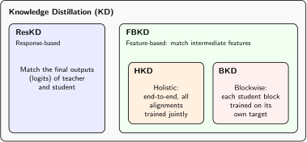
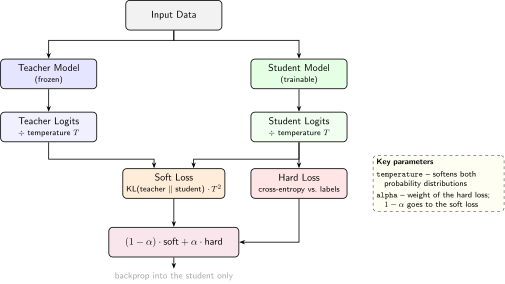
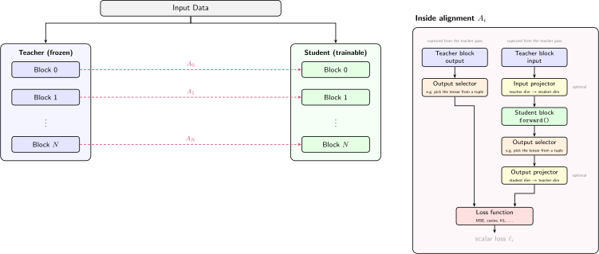

# Concepts

This page explains the key ideas behind SilverSpoon-KD's design.

## Knowledge distillation

Knowledge distillation trains a smaller **student** model to reproduce the behavior
of a larger **teacher** model. The teacher is frozen during training; only the
student's parameters are updated.

There are two broad families of approaches:

- **Response-based distillation** (ResKD) matches the teacher's output logits using
  temperature-scaled soft targets (the classic Hinton et al. approach).
- **Feature-based distillation** (FBKD) matches intermediate representations (hidden
  states, attention outputs, etc.) between teacher and student layers.

SilverSpoon-KD supports both. The diagram below shows how these paradigms relate:



## Response-based distillation (ResKD)

Response-based KD matches the teacher's and student's final output logits. It's the simplest
form of distillation and requires no alignments.



The `ResponseBasedDistiller` implements Hinton et al. (2015) soft-label distillation:

$$
\mathcal{L} = (1 - \alpha) \cdot \mathcal{L}_{\text{soft}}(z_s, z_t)
    + \alpha \cdot \mathcal{L}_{\text{hard}}
$$

where \(\mathcal{L}_{\text{soft}}\) is a user-provided loss function (e.g.
temperature-scaled KL divergence) and \(\mathcal{L}_{\text{hard}}\) is the
model's own task loss (`outputs.loss`). \(\alpha\) controls the balance between
soft and hard losses. The soft loss function is passed to the distiller
constructor — any callable with signature `(student_logits, teacher_logits) → scalar`.

## Feature-based distillation (FBKD)

FBKD (used by `HolisticDistiller` and `BlockwiseDistiller`) matches intermediate layer representations via
**alignments**. Each alignment pairs a teacher block with a student block and
defines how to compare their outputs.



## Alignments

An **alignment** pairs one teacher module with one student module and
defines how they are compared during training.

```
Alignment
├── teacher_block: nn.Module          # the teacher layer to capture
├── student_block: nn.Module          # the student layer to train
├── teacher_output_selector: callable        # optional output selector (e.g., tuple extraction)
├── student_output_selector: callable        # optional output selector
├── loss_function: callable
├── loss_weight: float (default 1.0)  # per-alignment loss contribution weight
├── optimizer / scheduler
├── input_projector: nn.Module (optional)
└── output_projector: nn.Module (optional)
```

Each `Alignment` carries its own optimizer, scheduler, and loss function,
so different layer pairs can use different training configurations.

### Terminology

**Alignment**
:   A pairing of one teacher block with one student block, plus the output
    selector(s), projector(s), loss function, optimizer, and scheduler for
    that pair.

**Output Selector**
:   Extracts a single tensor from a tuple output,
    e.g., `(hidden_states, attn_weights)` → `hidden_states`.
    No trainable parameters. (`OutputSelector` class)

**Input Projector**
:   A learned `nn.Linear` (or `nn.Conv2d`) that maps the teacher's output
    dimension to the student's input dimension, so the student block can
    process teacher-sized activations. Used in blockwise distillation.

**Output Projector**
:   A learned `nn.Linear` (or `nn.Conv2d`) that maps the student's output
    dimension to the teacher's output dimension, so the loss function can
    compare them.

**Auto Projector**
:   When `auto_projector=True` (the default), projectors are automatically
    inferred and created on the first forward pass if a dimension mismatch
    is detected.

### Output selectors

When a module returns a tuple (e.g., `(hidden_states, attention_weights)`),
output selectors pick the element to compare. `OutputSelector(index=0)` extracts
the first element. You can also pass any callable.

### Projectors

When teacher and student layers have different hidden dimensions, a **projector**
bridges the gap. SilverSpoon-KD provides linear and conv2d projectors that are
trained alongside the student:

- `GenericLinearProjector` -- projects along the feature dimension
- `GenericConv2dProjector` -- projects along channel dimensions

Set `auto_projector=True` on an `Alignment` (the default when using
`create_alignments`) to let the library detect shape mismatches on the first
forward pass and create projectors automatically.

:::{tip}
Auto-projectors default to PyTorch's kaiming uniform initialization. You can
change this via the `projector_init` parameter on `create_alignments` or
`Alignment`: pass `"normal"` (std=0.02, BERT-style), `"xavier"` (Xavier
uniform), or any callable `fn(module)` for custom initialization.
:::

### Loss weighting

Each alignment has a `loss_weight` (default `1.0`) that scales its contribution
to the total loss. This lets you emphasize certain layers — for example, giving
later layers higher weight:

```python
alignments[0].loss_weight = 0.25  # early layer — low priority
alignments[1].loss_weight = 0.50
alignments[2].loss_weight = 1.00  # final layer — high priority
```

**Only the ratios between weights matter**, not their absolute values.
Weights `[2, 3, 5]` produce the same gradient proportions as `[0.2, 0.3, 0.5]`.
Weights do not need to sum to 1.

#### Magnitude-aware weighting

When loss magnitudes differ across alignments (e.g., one layer's loss is 1000
while another's is 10), the larger loss dominates gradient updates even with
a smaller weight. Enable `magnitude_aware_weighting` to normalize each loss by
its current magnitude before applying weights:

```python
args = TrainingArguments(
    ...,
    magnitude_aware_weighting=True,
)
```

With magnitude-aware weighting, the total loss becomes:

$$
\mathcal{L}_\text{total} = \sum_i w_i \cdot \frac{L_i}{\operatorname{sg}(L_i)}
$$

where $\operatorname{sg}$ denotes stop-gradient (`.detach()`). Each component's
gradient is scaled by $w_i / |L_i|$, ensuring gradient contributions are
proportional to weights regardless of loss magnitudes.

:::{note}
Magnitude-aware weighting changes the total loss scale to approximately
`sum(weights)`. Learning rates may need adjustment. Per-alignment raw
losses are still logged separately for monitoring convergence.
:::

:::{warning}
`loss_weight` is supported by `HolisticDistiller` only.
`BlockwiseDistiller` will emit a warning if non-default weights are set.
`ResponseBasedDistiller` uses its own `alpha` parameter for soft/hard
weighting and also supports `magnitude_aware_weighting`.
:::

## Distillation strategies

### BlockwiseDistiller

Trains each aligned layer pair independently. For every training step:

1. Run the teacher forward pass and capture outputs at each aligned module.
2. For each alignment, run the student block on the teacher's captured inputs.
3. Compute the loss between student and teacher outputs.
4. Backpropagate and update that student block's parameters.

Because each block is trained in isolation, gradients never cross block
boundaries: every block receives direct supervision from its teacher
counterpart and has its own optimizer and scheduler. With
`backward_per_block=True` in `TrainingArguments`, the backward pass runs after
each block instead of after summing all block losses, which keeps peak memory
at a single block's worth.

### HolisticDistiller

Runs full forward passes through both teacher and student models, captures
intermediate activations, computes alignment losses across all layers, and
performs a single backward pass. This allows gradients to flow across layers,
which can be important when cross-layer interactions affect distillation quality.

### ResponseBasedDistiller

See [Response-based distillation (ResKD)](#response-based-distillation-reskd) above.

## Capture engine

The `ModuleCaptureEngine` registers PyTorch forward hooks on specified modules
to record their inputs and outputs during a forward pass. Distillers use this
to obtain teacher (and sometimes student) activations without modifying model
code.

With `auto_truncate=True`, the engine stops the forward pass as soon as all
captured modules have produced their outputs. For example, if a 24-layer
teacher is aligned at layers 0–5, layers 6–23 are skipped entirely — saving
both compute and memory. The option is off by default (`auto_truncate=False`)
on `ModuleCaptureEngine`, `BlockwiseDistiller`, and `HolisticDistiller`:
truncation works by raising an exception from the last capture hook, which is
incompatible with FSDP and `torch.compile`.

:::{tip}
If you only align an early subset of layers and train on a single GPU or with
DDP (without `torch.compile`), pass `auto_truncate=True` to the distiller for
a speedup — the teacher forward pass exits as soon as the last aligned module
has run.
:::

:::{note}
When a model is FSDP-wrapped and needs a backward pass (the student in
`HolisticDistiller`), the distiller forces `auto_truncate` off for that model
and logs a warning. A forward-only FSDP-wrapped teacher can still be truncated.
:::

## Loss functions

All losses follow the signature `(student_output, teacher_output) -> scalar`:

| Name | Aliases | Description |
|------|---------|-------------|
| `mse` | | Mean squared error (default) |
| `normalized_mse` | | Z-score normalized MSE (matches relational structure, ignores scale) |
| `cosine` | | Cosine similarity loss (\(1 - \cos(s, t)\)) |
| `smooth_l1` | | Smooth L1 / Huber loss |
| `kl_divergence` | `kl_div` | KL divergence (with temperature scaling and optional chunking) |
| `jsd` | | Jensen-Shannon Divergence (with temperature and interpolation weight) |
| `logit_lens_kl` | | Project through LM head, then KL divergence on token distributions |
| `contrastive` | | InfoNCE-based contrastive distillation loss |
| `angular_magnitude` | | Decomposed angular (cosine) + magnitude (norm) loss |
| `mahalanobis_mse` | `mahal_mse` | MSE under a learned Mahalanobis metric |
| `mahalanobis_cosine` | `mahal_cosine` | Cosine loss under a learned Mahalanobis metric |
| `relkd_distance` | | RelKD distance-wise distillation |
| `relkd_angle` | | RelKD angle-wise distillation |
| `relkd_distance_angle` | `relkd_da` | Combined RelKD distance + angle loss |

Use `silverspoon_kd.get_loss_function(name, **kwargs)` to retrieve a loss by name.
The function is available at the top-level package import. Loss-specific
hyperparameters (e.g., `temperature`, `weight_matrix`) are passed as keyword
arguments.

## Utilities

SilverSpoon-KD provides several utility functions for common model preparation tasks.
See the [Utilities guide](utilities.md) for detailed usage.

### reconfig_model

Creates a new model with a modified configuration (e.g., fewer attention heads or
a smaller intermediate size) while preserving the same model class. Optionally
copies matching weights from the source model and freezes them.

### prune_model

Performs structured pruning using importance-based weight selection. Uses
Torch-Pruning's `DependencyGraph` to discover parameter couplings and propagate
pruning correctly. A two-pass algorithm handles attention heads separately from
MLP width to avoid dependency graph cycles.

### freeze_parameters

Freezes model parameters whose names match any of the provided regex patterns.
Use `thaw_not_matched=True` to also unfreeze parameters that don't match.

### Distiller factory

The `Distiller` factory function creates the appropriate distiller by string name:

```python
from silverspoon_kd import Distiller

distiller = Distiller(
    distiller_type="blockwise",  # or "holistic", "response_based"
    teacher_model=teacher,
    alignments=alignments,
    train_dataset=train_dataset,
    args=args,
)
```

Short aliases are also accepted: `"bkd"` (blockwise), `"hkd"` (holistic),
`"reskd"` (response-based).
